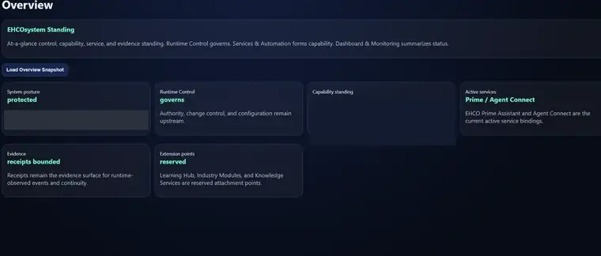
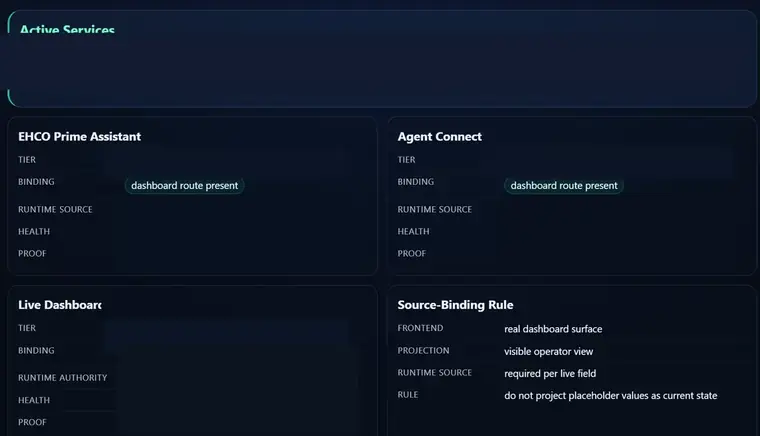

# EHCOsystem

**Public technical architecture and evidence for EHCOnomics' Instantiated AI ecosystem.**

**Instantiated AI** is the architectural category. **EHCOsystem** is EHCOnomics' implementation of that category across a governed computational estate in which identity, authority, state, memory, source, permissible range, evidence, release, and consequence are established as computational conditions around intelligence.

**EHCO AI-OS is the realized Tier One Runtime** of EHCOsystem with accepted standing **52/53** and accepted baseline **`REALIZED / COMPLETE_IN_ACCEPTED_SCOPE`**. `EHCO_DOCKER_PORTABILITY` is the **PRIMARY_ACCESSIBLE_RUNTIME_PROJECTION** and the **fully containerized, deployment-ready portable delivery form** of the established hardened Runtime/root-image lineage. Owning Docker/host evidence establishes successful local launch/relaunch behavior, healthy bridge and worker services, persistent Runtime/proof/data surfaces, Docker networking, hardened image identity, and local service response. **EHCO AI-OS has physically operated as a self-hosted local Docker Runtime.** The **current accepted working EHCO Dashboard baseline** is the principal presently established **Tier Three projection baseline** within that portability estate, and the local Dashboard was served on **host port 8080** during the captured operating state. **Downstream governed components** provide deterministic language, range/reasoning, retrieval/evidence, relationship continuity, coordination, research, and domain capability.

## Dashboard visual orientation

The EHCO Dashboard gives reviewers a visual orientation across governed system posture, service coordination, authority relationships, evidence, health, readiness, and component interaction. These dated interface views complement the repository's claim-to-evidence routes and derive from the operating local EHCO Docker Runtime.

*EHCO Dashboard — Tier Three projection/interface view. Public-safe derivative from an owner-supplied June 2026 EHCO Dashboard capture. Tier One Runtime authority and current Runtime-state ownership remain with `INSTANTIATED_EHCO_RUNTIME`. The source capture derives from the operating local EHCO Docker Runtime, with the Dashboard served on host port 8080 during the captured operating state.*

*EHCO Dashboard — Tier Three projection/interface view. Public-safe derivative from an owner-supplied June 2026 EHCO Dashboard capture. Tier One Runtime authority and current Runtime-state ownership remain with `INSTANTIATED_EHCO_RUNTIME`. The source capture derives from the operating local EHCO Docker Runtime, with the Dashboard served on host port 8080 during the captured operating state.*

**[Explore all eight Dashboard views](architecture/EHCO-AI-OS-SYSTEM-CARD.md#dashboard-visual-orientation)**

## Current maturity

The **foundational and shared EHCOsystem spine is substantially established**. Current development is concentrated in component finalization and hardening, EHCO RAG implementation, research/foundation reconciliation, and continuing domain/application expansion.

The principal shared spine has differentiated maturity:

- **EHCO Language Model** — mature deterministic computational-language system built as `DETERMINISTIC_COMPUTATIONAL_LANGUAGE / SINGLE_PATH / EXPLICIT_EHCO_COMPUTATION / ZERO_WEIGHT_ONLY / ZERO WEIGHTS TRAINED`. Its accepted source includes the Language Kernel, Language Math, deterministic tokenizer, evaluation, service boundary, schemas, registries, fixtures, deterministic tests, packaging, dependency locks, owner seams, and production-lifecycle source. The system is in an **advanced near-final maturation cycle** focused on strengthening computational meaning, deepening linguistic and reasoning capability, tightening evidence and owner integration, and extending integrated deterministic qualification across the established architecture.
- **EHCO Range Reactor** — mature deterministic proof-carrying implication, reachability, range and reasoning system with accepted executable reference semantics, identity/replay, contradiction and frontier preservation, independently verified finite semantic collapse, service/container boundaries, production/release controls, Prime/Primordia interoperability, and physical host qualification covering service execution, fail-closed behavior, timeout/unavailability handling, restart/recovery, portability, and diagnostic performance.
- **EHCO RAG** — governed retrieval, context, source-custody, provenance, and evidence component with an accepted controlled baseline and active Stage 1 implementation.
- **EHCO Prime** — advanced individual-facing relationship and assistant-coordination service with mature source/control hardening.
- **EHCO Agent Connect** — advanced registry, discovery, compatibility, health-observation, and candidate-routing coordination service with mature source/control hardening.

## Start here

1. **[Instantiated AI — Public Architecture Definition](architecture/INSTANTIATED-AI.md)** — category definition, computational standing, dependency inversion, source/memory standing, and model independence.
2. **[EHCOsystem — An Instantiated AI Ecosystem](architecture/EHCO-TECHNOLOGY-ESTATE.md)** — complete public technology-estate map and current maturity.
3. **[Public Architecture Diagrams](architecture/diagrams/README.md)** — Runtime, projection, computational ownership, component spine, applications, and evidence relationships.
4. **[Ecosystem Claim → Evidence Matrix](assurance/ECOSYSTEM-CLAIM-EVIDENCE-MATRIX.md)** — claim, maturity, evidence class, verification method, source-review date, and evidence scope.
5. **[Ecosystem Technical Diligence](ECOSYSTEM-DILIGENCE.md)** — reviewer route from category architecture through source-grounded component evidence.

## Verify this repository

The public representation is machine-checked against a canonical claim registry and the existing evidence validators.

- **[Canonical Public Claim Registry](assurance/PUBLIC-CLAIM-REGISTRY.json)** — machine-readable current propositions, evidence classes, verification routes, and disclosure ceilings.
- **[Public Repository Validation](verification/README.md)** — deterministic repository, claim-registry, Language Model, Range Reactor, and release-identity verification routes.
- **[EHCO AI-OS Technical Diligence](TECHNICAL-DILIGENCE.md)** — focused Tier One route through local-operation evidence, observed Runtime evidence, implementation anchors, and performance characterization.

## EHCOsystem at a glance

### Tier One Runtime foundation

**EHCO AI-OS** owns the governing Runtime relationships for authority, scope, recognized state, transition, consequence, continuity, persistence, withholding and release, correction and recovery, and Runtime-originated proof.

### Primary accessible Runtime projection and Tier Three baseline

- **EHCO_DOCKER_PORTABILITY** carries the primary accessible Runtime projection and the fully containerized, deployment-ready portable delivery form of the established hardened Runtime/root-image lineage.
- **EHCO AI-OS local operation** is physically evidenced as a self-hosted local Docker Runtime with Dashboard, bridge, worker, networking, persistent Runtime/proof/data surfaces, health behavior, and hardened image identities.
- **EHCO Dashboard** provides the current accepted working Tier Three projection baseline across overview, live trace, service/API state, health, readiness, rollback, authority interpretation, and settings concerns; the captured local Dashboard service is bound to host port 8080.

### Principal shared downstream component spine

The shared spine provides reusable computational and service capabilities across deterministic language, range/reasoning, governed retrieval/evidence, relationship continuity, and coordination. Each component retains its own source and lifecycle state.

### Governed research and foundation estates

- **EHCO Memory** — memory and continuity research foundation.
- **Primordia** — computational substrate, specification/language, semantics, and engineering-system research.
- **EHCO Recursion** — recursion, trust/coherence, collapse/failure, bounded re-entry, and composition research.
- **EHCO Fractal Systems** — structural/form preservation, admissibility, continuity, drift, scale, projection, and lineage research.

### Continuing downstream governed domain/application expansion

The application estate includes **EHCO Energy**, **Noble Law**, **EHCO War Room**, **HTPI**, **EHCO Project Construct**, **EHCO Luminis**, **EHCO Nexus**, and **EHCO Permit Trace**. These components turn the shared instantiated architecture into domain-specific intelligence, deterministic workflows, evidence systems, and governed application services.

## Public evidence

EHCOsystem publishes evidence according to the proposition being examined: controlled architecture, exact artifact identity, manifests and hashes, selected test fixtures, source-reviewed synthetic capability evidence, source anchors, bounded observations, discrepancy records, receipts, and verification tooling.

The **EHCO Language Model Public Test Snapshot v1** publishes seven exact synthetic fixtures covering **62 cases**, expected dispositions, a qualification-test index, provenance manifest, and validation tooling. It is one inspectable window into a substantially deeper controlled implementation and qualification estate.

**[Inspect the Language Model test evidence](language-model/evidence/public-test-snapshot-v1/README.md)**

The **EHCO Range Reactor Public Capability Snapshot v1** publishes eight public-safe synthetic capability vectors covering deterministic replay, contradiction/frontier preservation, modal distinction, semantic collapse with witness-fiber custody, independent collapse verification, source-mutation identity sensitivity, and grounded proof custody. Its manifest binds the snapshot to the accepted owning-source revision reviewed for publication while keeping controlled implementation source private.

**[Inspect the Range Reactor capability evidence](range-reactor/evidence/public-capability-snapshot-v1/README.md)**

## Architecture, evidence, and governance

- [EHCO Range Reactor](range-reactor/README.md)
- [Runtime, Repository, and Test-Estate Boundary](architecture/runtime-repository-and-test-estate-boundary.md)
- [Repository Governance](GOVERNANCE.md)
- [Security and Responsible Disclosure](SECURITY.md)
- [Public Documentation and Evidence Provenance](PROVENANCE.md)
- [Proprietary Public Inspection License](LICENSE)
- [EHCOsystem Library](LIBRARY.md)

Copyright (c) 2026 EHCOnomics. All rights reserved.
