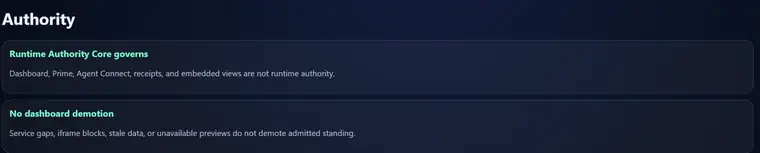
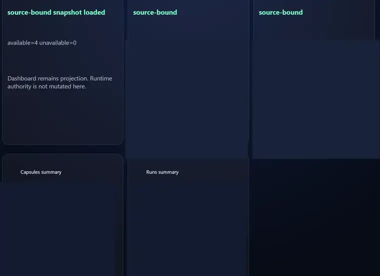
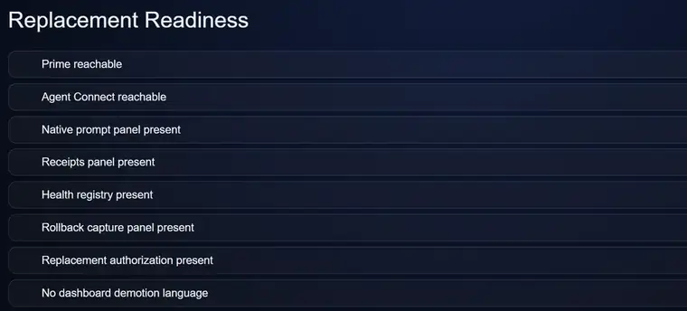
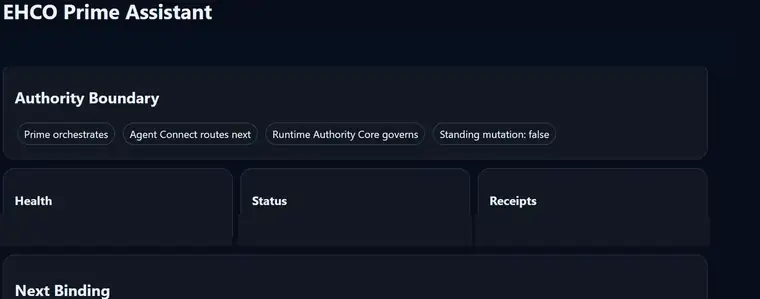
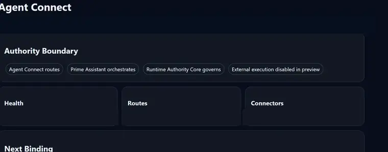

# EHCO AI-OS Public System Card

## Purpose

EHCO AI-OS is the realized Tier One Runtime of EHCOsystem with accepted standing baseline **52/53**. It is the governing foundation for authority, scope, recognized state, transition, consequence, continuity, persistence, withholding/release, correction/recovery, and Runtime-originated proof.

## Architectural thesis

EHCOnomics distinguishes **inference** and **instantiation** as complementary computational functions. Inference constructs representations. Instantiation establishes the operational conditions under which identity, participation, authority, state, evidence, release and consequence acquire governing meaning.

**Claim and proof are distinct evidence classes.** Claims represent propositions; proof binds propositions to evidence, scope, authority, time and operational state.

## Public architectural layers

### Tier One — Runtime Authority

Tier One establishes and maintains the conditions for authority, state transition, consequence, persistence, withholding/release, recovery and proof.

### Downstream governed components

Persistent Tier Two software identities are **downstream governed components**. They own computational, evidence, relationship, coordination, research and domain capabilities. Component identity, implementation maturity, application/service realization and Runtime participation are independently governed dimensions.

### Tier Three — Projection

Tier Three provides visibility, interpretation, reporting, dashboards, metrics and other public-safe projections over governed information.

## Public system functions

- **Runtime Authority** — admission, authority, scope, recognized state, transition, consequence, withholding/release, correction/recovery and Runtime-originated proof.
- **Memory & Continuity** — organizational context and continuity across change.
- **Proof & Reflection** — evidence, auditability, proof relationships and claim/proof distinction.
- **Connection & Expansion** — governed integration of new systems, services, agents and capabilities.

## Dashboard visual orientation

These dated public-safe views orient reviewers to projection relationships across authority, evidence, health, readiness, relationship continuity, and coordination.

### Authority boundary

*EHCO Dashboard — Tier Three projection/interface view. Public-safe derivative from an owner-supplied June 2026 EHCO Dashboard capture. Tier One Runtime authority and current Runtime-state ownership remain with `INSTANTIATED_EHCO_RUNTIME`.*

### Evidence and receipts

*EHCO Dashboard — Tier Three projection/interface view. Public-safe derivative from an owner-supplied June 2026 EHCO Dashboard capture. Tier One Runtime authority and current Runtime-state ownership remain with `INSTANTIATED_EHCO_RUNTIME`.*

### Health registry

*EHCO Dashboard — Tier Three projection/interface view. Public-safe derivative from an owner-supplied June 2026 EHCO Dashboard capture. Tier One Runtime authority and current Runtime-state ownership remain with `INSTANTIATED_EHCO_RUNTIME`.*

### Replacement readiness

*EHCO Dashboard — Tier Three projection/interface view. Public-safe derivative from an owner-supplied June 2026 EHCO Dashboard capture. Tier One Runtime authority and current Runtime-state ownership remain with `INSTANTIATED_EHCO_RUNTIME`.*

### Prime relationship

*EHCO Dashboard — Tier Three projection/interface view. Public-safe derivative from an owner-supplied June 2026 EHCO Dashboard capture. Tier One Runtime authority and current Runtime-state ownership remain with `INSTANTIATED_EHCO_RUNTIME`.*

### Agent Connect coordination

*EHCO Dashboard — Tier Three projection/interface view. Public-safe derivative from an owner-supplied June 2026 EHCO Dashboard capture. Tier One Runtime authority and current Runtime-state ownership remain with `INSTANTIATED_EHCO_RUNTIME`.*

## Evidence and interpretation

The public repository exposes evidence through the canonical dossier, Public Evidence Companion, packet manifests, hashes, receipts, verification tooling, architecture records and publication controls. Each record identifies its evidence class and scope.

For the canonical separation principles, use [System Invariants](SYSTEM-INVARIANTS.md). For evidence-domain ownership, use the [Runtime, Repository, and Test-Estate Boundary](runtime-repository-and-test-estate-boundary.md).

## Public reading path

1. [EHCOsystem Technology Estate](EHCO-TECHNOLOGY-ESTATE.md)
2. [Runtime, Repository, and Test-Estate Boundary](runtime-repository-and-test-estate-boundary.md)
3. [EHCO AI-OS Instantiated System](EHCO-AI-OS-INSTANTIATED-SYSTEM.md)
4. [Governed Runtime Architecture](GOVERNED-RUNTIME-ARCHITECTURE.md)
5. [System Invariants](SYSTEM-INVARIANTS.md)
6. [Public Evidence Companion](../evidence/README.md)
7. [Ecosystem Claim → Evidence Matrix](../assurance/ECOSYSTEM-CLAIM-EVIDENCE-MATRIX.md)

## Revision history

| Version | Date | Change |
|---|---|---|
| 1.3 | 2026-08-29 | Added eight-view Dashboard visual orientation with dated public-safe Tier Three projection/interface framing. |
| 1.2 | 2026-08-28 | Recast the system card around affirmative ownership, evidence classes and architectural functions. |
| 1.1 | 2026-08-25 | Reconciled current component/participation terminology. |
