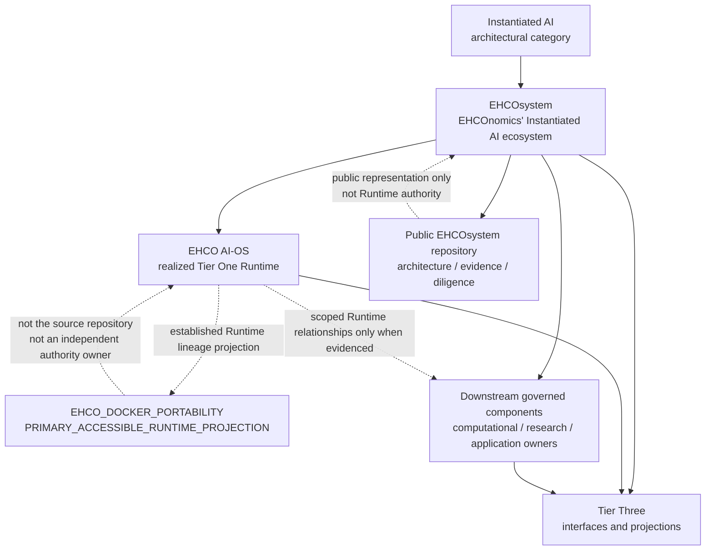
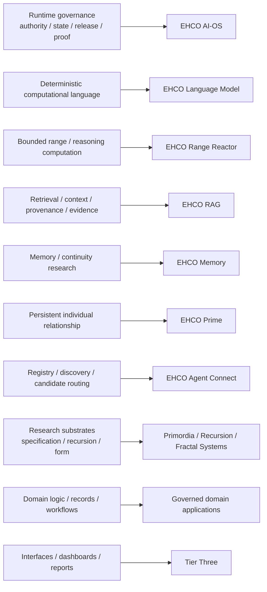
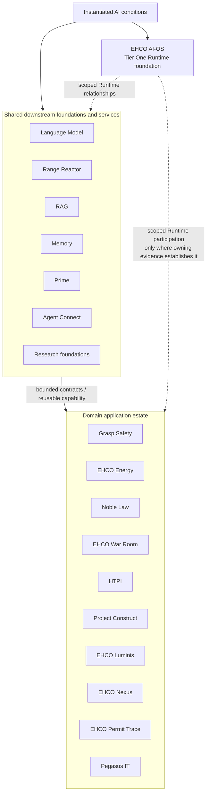
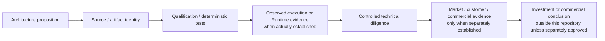

# EHCOsystem Public Architecture Diagrams

These diagrams are original public-safe explanatory views of the architecture described in [Instantiated AI](../INSTANTIATED-AI.md), [EHCOsystem — An Instantiated AI Ecosystem](../EHCO-TECHNOLOGY-ESTATE.md), and the [Ecosystem Claim → Evidence Matrix](../../assurance/ECOSYSTEM-CLAIM-EVIDENCE-MATRIX.md).

They intentionally show **relationships and ownership**, not private topology, deployment configuration, protected implementation mechanics, current Runtime participation, or confidential investment material. This diagram record does not create implementation, deployment, Runtime participation, market validation, or Runtime proof.

## 1. Category, Runtime, components, portability, and projection

**Interpretation:** Instantiated AI is the category; EHCOsystem is the ecosystem. EHCO AI-OS is the realized Tier One Runtime foundation. `EHCO_DOCKER_PORTABILITY` is the `PRIMARY_ACCESSIBLE_RUNTIME_PROJECTION` within the established hardened Runtime/root-image lineage; it is distinct from the EHCO AI-OS source repository and from repository-local Docker/Compose test realizations. Downstream component identity does not itself establish Runtime participation. Tier Three and the public repository project governed information without becoming Runtime truth or authority.

## 2. Computational ownership across the ecosystem

**Interpretation:** ownership is intentionally separated. Language computation is not Runtime authority; retrieval is not application truth; coordination is not admission; application logic is not Tier One governance; projection is not the state it displays.

## 3. Shared foundations to domain applications

**Interpretation:** the applications are not unrelated products bolted onto an AI-OS. They are governed domain components that can consume reusable EHCO capabilities under bounded contracts while retaining their own domain logic, records, evidence, application lifecycle, and realization state. Runtime participation remains orthogonal and evidence-scoped.

## 4. Technical evidence to market evidence ladder

**Interpretation:** evidence classes accumulate only when the relevant owning evidence exists. A public architecture statement does not become implementation evidence; a passing component test does not become deployment or Runtime proof; technical evidence does not manufacture market validation; and this public technical repository does not publish confidential investment conclusions merely because they may be informed by the same underlying technology estate.

## Reading rule

Use these diagrams for orientation, then verify material propositions through the [Ecosystem Claim → Evidence Matrix](../../assurance/ECOSYSTEM-CLAIM-EVIDENCE-MATRIX.md). The [Runtime, Repository, and Test-Estate Boundary](../runtime-repository-and-test-estate-boundary.md) controls detailed Runtime/source/evidence interpretation.
