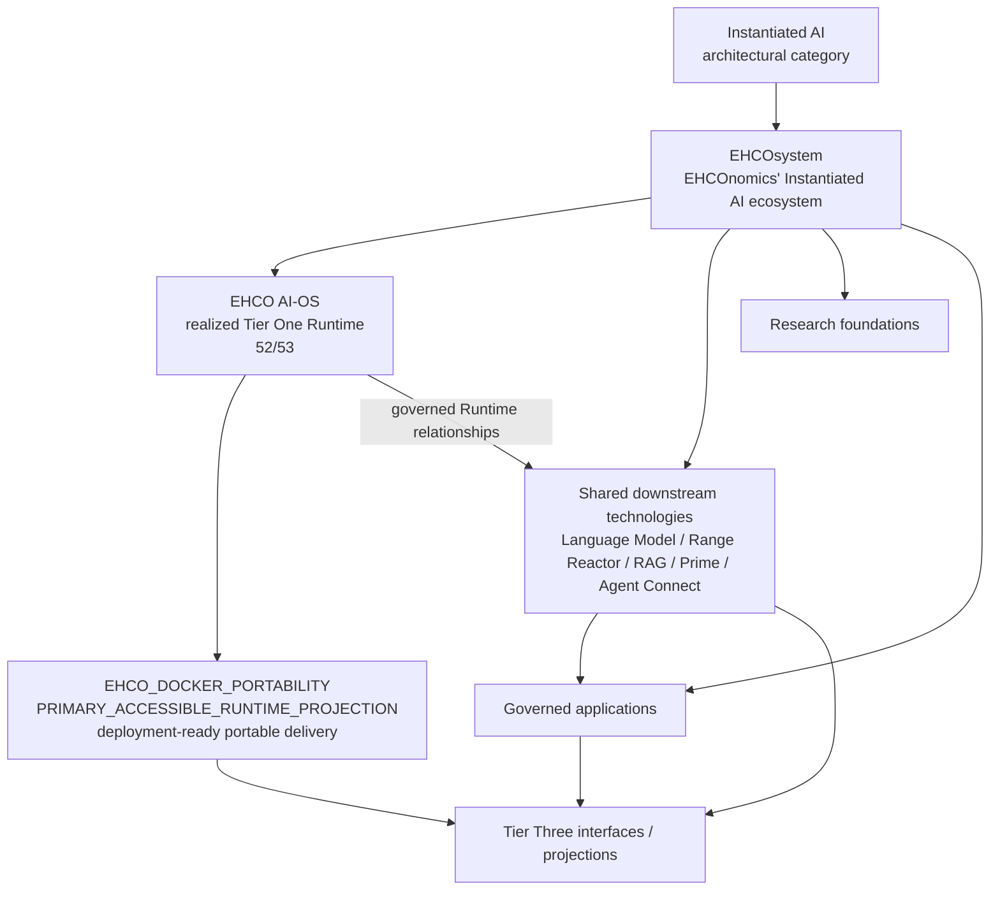
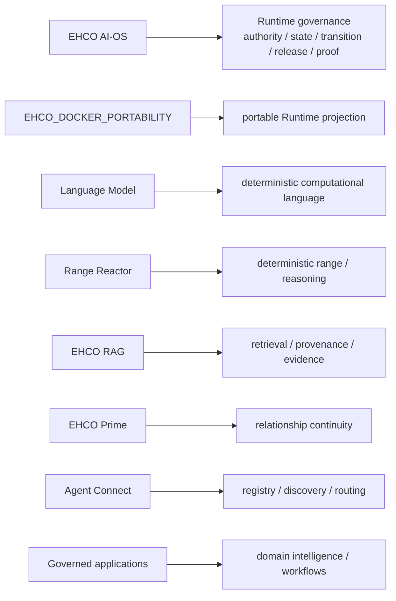
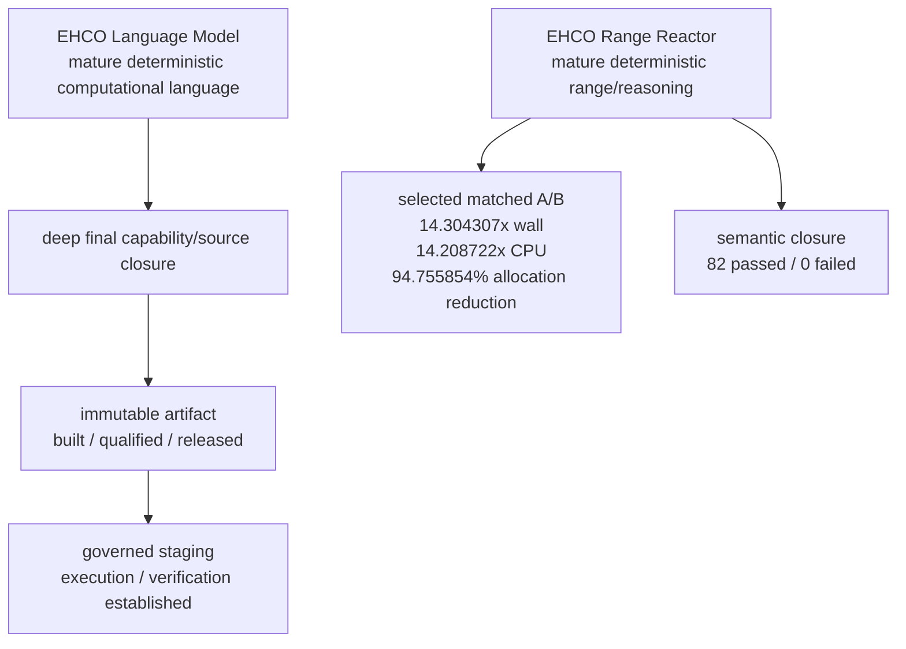
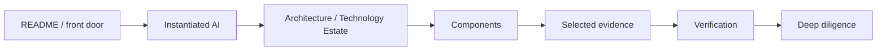

# EHCOsystem Public Architecture Diagrams

These diagrams provide a compact visual route through the [Instantiated AI](../INSTANTIATED-AI.md) category, [EHCOsystem Technology Estate](../EHCO-TECHNOLOGY-ESTATE.md), Runtime projection, shared technologies, applications, and evidence.

## 1. Category to ecosystem

## 2. Computational ownership

## 3. Language Model and Range Reactor

## 4. Public review path

## Continue reading

- [EHCOsystem Technology Estate](../EHCO-TECHNOLOGY-ESTATE.md)
- [Components and Runtime Relationships](../ecosystem-components-and-participation.md)
- [Language Model](../../language-model/README.md)
- [Range Reactor](../../range-reactor/README.md)
- [Current Runtime / Full Flex evidence](../../runtime/README.md)
- [Public verification](../../verification/README.md)
