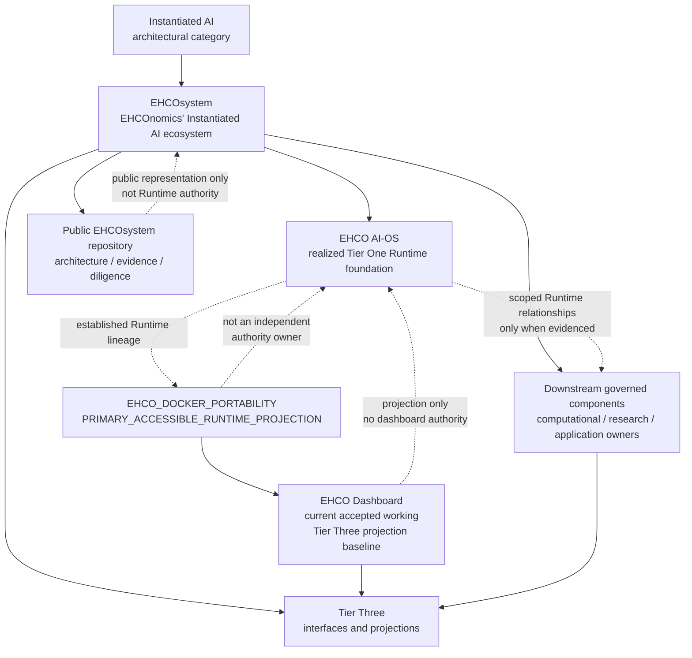
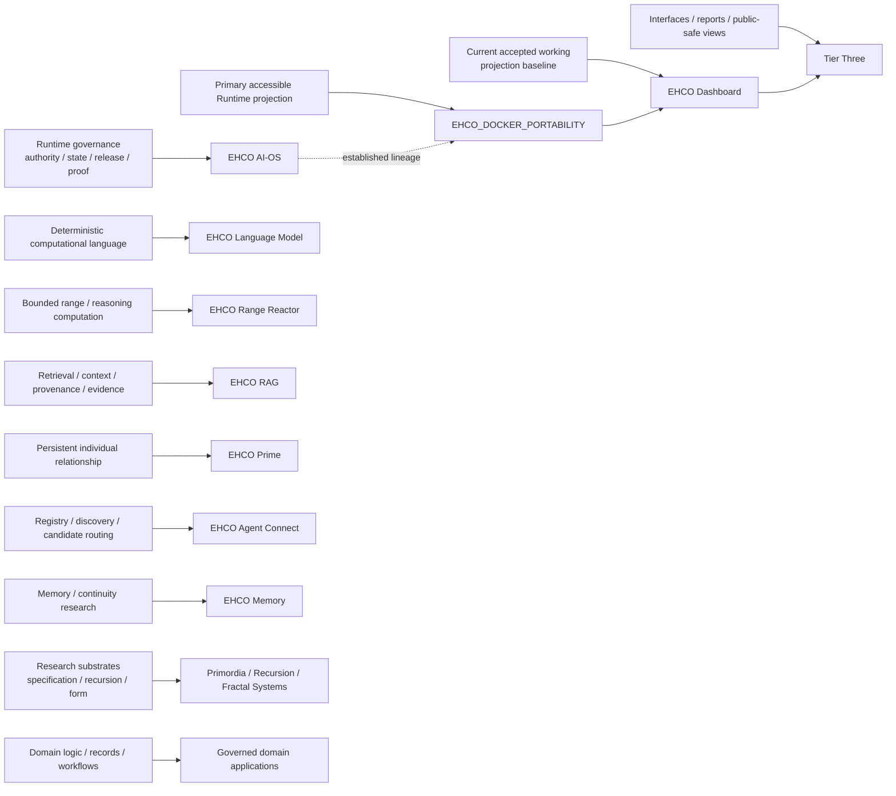
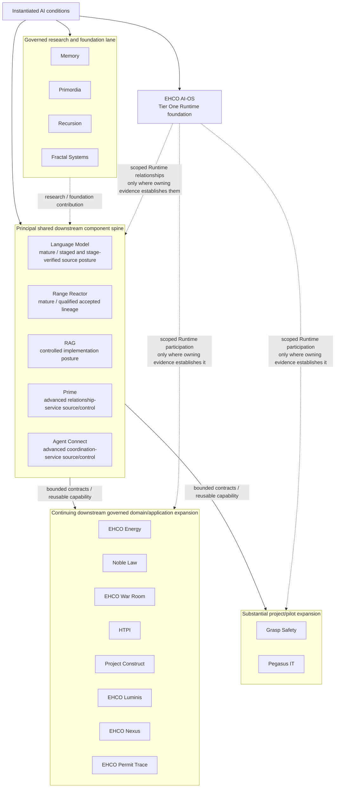
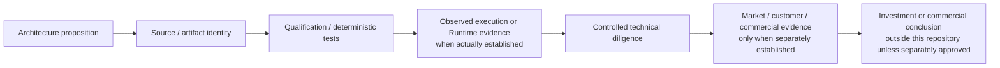

# EHCOsystem Public Architecture Diagrams

These diagrams are original public-safe explanatory views of the architecture described in [Instantiated AI](../INSTANTIATED-AI.md), [EHCOsystem — An Instantiated AI Ecosystem](../EHCO-TECHNOLOGY-ESTATE.md), and the [Ecosystem Claim → Evidence Matrix](../../assurance/ECOSYSTEM-CLAIM-EVIDENCE-MATRIX.md).

They intentionally show **relationships, estate lanes, maturity distinctions, and ownership**, not private topology, deployment configuration, protected implementation mechanics, current Runtime participation, or confidential investment material. This diagram record does not create implementation, deployment, Runtime participation, market validation, or Runtime proof.

## 1. Category, Runtime, components, portability, and projection

**Interpretation:** Instantiated AI is the category; EHCOsystem is the ecosystem. EHCO AI-OS is the realized Tier One Runtime foundation. `EHCO_DOCKER_PORTABILITY` is the `PRIMARY_ACCESSIBLE_RUNTIME_PROJECTION` of the established Runtime lineage. The EHCO Dashboard is the current accepted working Tier Three projection baseline within that portability estate. The portability layer, Dashboard, Tier Three surfaces, downstream components, and public repository do not become independent Runtime authority or present Runtime truth.

## 2. Computational ownership across the ecosystem

**Interpretation:** ownership is intentionally separated. Language computation is not Runtime authority; retrieval is not application truth; coordination is not admission; application logic is not Tier One governance; and projection is not the state it displays. The principal shared component spine contains different maturity postures rather than one uniform status.

## 3. Shared foundations to domain applications

**Interpretation:** current source review supports a qualitative posture in which the foundational/shared EHCOsystem spine is substantially established and remaining work is increasingly concentrated rather than foundational. Remaining work is separated into bounded finalization/hardening, RAG implementation, research/foundation reconciliation, and continuing downstream governed domain/application expansion. Grasp Safety and Pegasus IT remain downstream governed components but are tracked as substantial project/pilot expansion outside the public core-completion denominator. Lane placement changes no persistent identity, authority, evidence class, or Runtime relationship.

## 4. Technical evidence to market evidence ladder

**Interpretation:** evidence classes accumulate only when the relevant owning evidence exists. A public architecture statement does not become implementation evidence; a passing component test does not become deployment or Runtime proof; technical evidence does not manufacture market validation; and this public technical repository does not publish confidential investment conclusions merely because they may be informed by the same underlying technology estate.

## Reading rule

Use these diagrams for orientation, then verify material propositions through the [Ecosystem Claim → Evidence Matrix](../../assurance/ECOSYSTEM-CLAIM-EVIDENCE-MATRIX.md). The [Runtime, Repository, and Test-Estate Boundary](../runtime-repository-and-test-estate-boundary.md) controls detailed Runtime/source/evidence interpretation.

## Revision history

| Version | Date | Change |
|---|---|---|
| 1.1 | 2026-08-28 | Added the accepted working Dashboard projection baseline, differentiated shared-component maturity, research/application lane separation, and the Grasp/Pegasus project-pilot lane outside the public core-completion denominator. |
| 1.0 | 2026-08-26 | Added four original public-safe explanatory architecture views. |
