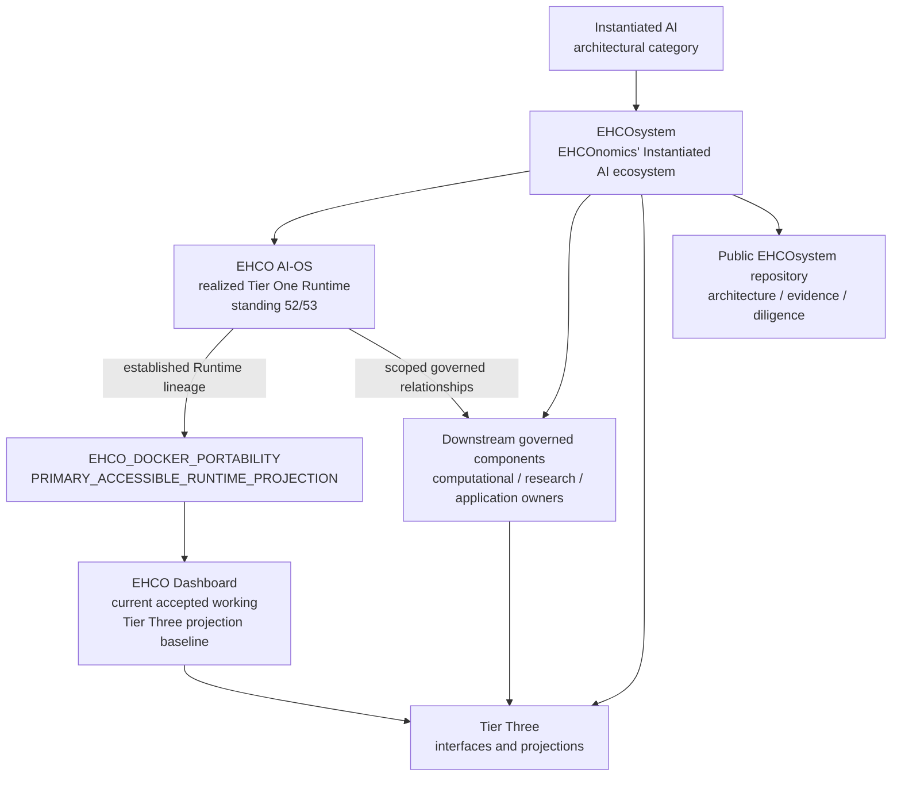
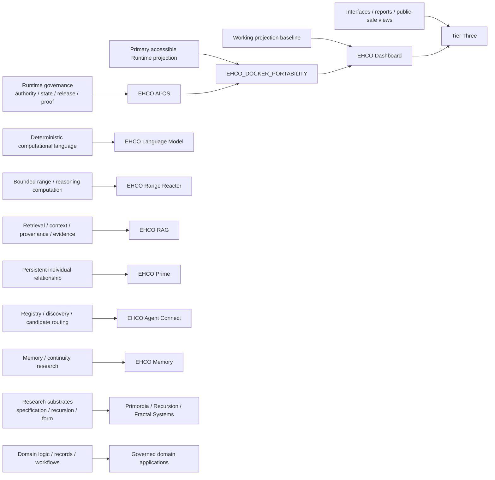
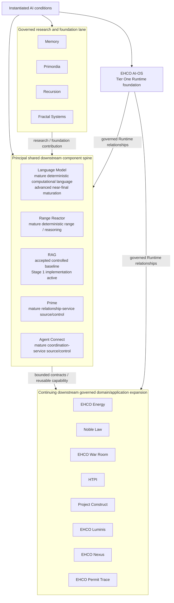
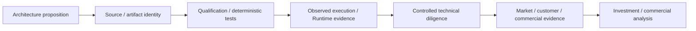

# EHCOsystem Public Architecture Diagrams

These diagrams provide public-safe views of the category, Runtime, component estate, computational ownership, maturity lanes, and evidence progression described in [Instantiated AI](../INSTANTIATED-AI.md), [EHCOsystem — An Instantiated AI Ecosystem](../EHCO-TECHNOLOGY-ESTATE.md), and the [Ecosystem Claim → Evidence Matrix](../../assurance/ECOSYSTEM-CLAIM-EVIDENCE-MATRIX.md).

## 1. Category, Runtime, portability, components, and projection

**Interpretation:** the category is Instantiated AI; the ecosystem is EHCOsystem; EHCO AI-OS owns Tier One Runtime authority; Docker Portability carries the primary accessible Runtime projection; Dashboard provides the current accepted Tier Three projection baseline; downstream components own their computational and domain capabilities; the public repository publishes architecture and evidence.

## 2. Computational ownership across the ecosystem

## 3. Shared foundations to domain applications

**Interpretation:** the foundational/shared spine is substantially established. The Language Model's mature deterministic foundation is in advanced near-final strengthening and qualification. Current ecosystem development also includes RAG implementation, research/foundation reconciliation, and continuing domain/application expansion.

## 4. Technical evidence progression

**Interpretation:** each evidence class establishes a specific proposition. Reviewers can move from architecture through source identity, qualification, observed effects, controlled diligence, and commercial evidence while preserving the owner and scope of each claim.

## Reading route

Use these diagrams for orientation, then follow the [Ecosystem Claim → Evidence Matrix](../../assurance/ECOSYSTEM-CLAIM-EVIDENCE-MATRIX.md) for claim-specific evidence and the [Runtime, Repository, and Test-Estate Boundary](../runtime-repository-and-test-estate-boundary.md) for evidence-domain ownership.

## Revision history

| Version | Date | Change |
|---|---|---|
| 1.3 | 2026-08-28 | Recast Language Model maturity as advanced near-final strengthening of an established deterministic system rather than an internal development-stage projection. |
| 1.2 | 2026-08-28 | Recast all diagrams around affirmative ownership, capability and maturity relationships and aligned the component set to the current public scope. |
| 1.1 | 2026-08-28 | Added differentiated component maturity and the Dashboard projection baseline. |
